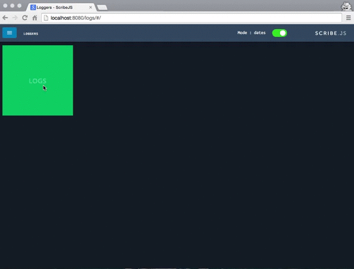
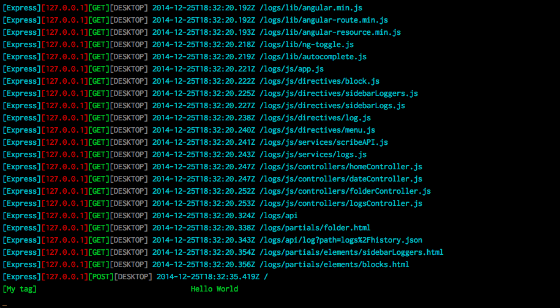

[](http://badge.fury.io/js/scribe-js)  [](https://travis-ci.org/bluejamesbond/Scribe.js)  
   


**Lightweight NodeJS Logging**

#Overview

Unlike many of the libraries out there, Scribe.js allows logging on multiple files and is divided into folders by date. And it is possibly the easiest logging you can implement.

##WebPanel
  

##Terminal
  

##Features

- Allows you to use the `console` object (which provides easy integration with existing systems)
- Save messages into JSON log files organized by user, date, and type or your custom rule
- Print messages into console using customized colors (to indicate level of importance)
- Adding context to logs such as time, tags, filename and line number
- Handles logging Objects / Arrays
- Log Express.js requests
- Provides a developer API to access your logs
- Features a rich HTML web panel to access logs from anywhere in the world

#Live Demo
You can access a live demo of the library [here](https://bluejamesbond.github.io/Scribe.js/).

#Wiki

For examples, tests, and API refer to the [Scribe.js Wiki](https://github.com/bluejamesbond/Scribe.js/wiki).

#Installation
```
npm install scribe-js
```

#Contributors

- [bluejamesbond](https://github.com/bluejamesbond)
- [guillaumewuip](https://github.com/guillaumewuip)
