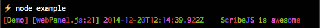
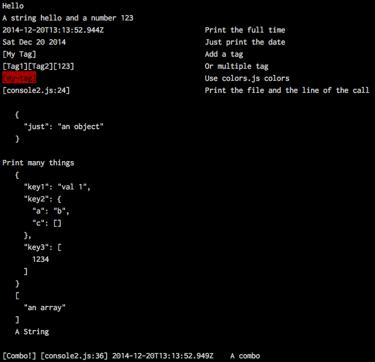
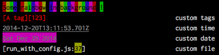
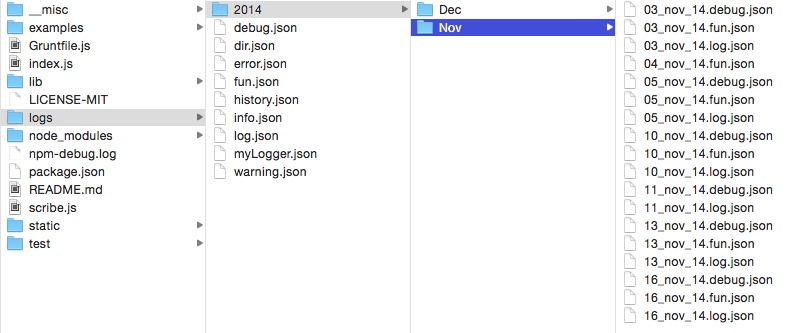

=======

**Lightweight NodeJS Logging**

```javascript
console.tag("Demo").time().file().log("%s is %s", "ScribeJS", "awesome")
```


# Overview

Unlike many of the libraries out there, Scribe.js allows logging on multiple files and is divided into folders by date.
And it is possibly the easiest logging you can implement.
And it does everything you need a basic logger to do :

- Keep using the `console` object
- Save messages into json log files organized by user, date, and type or your custom rule
- Print messages into console using colors indicating level of importance
- Adding context to logs such as time, tags, filename and line number

And :

- Logging express requests
- Providing a rich HTML web panel to access logs from your browser and an API


#Table of contents


<!-- toc -->

* [Overview](#overview)
* [Table of contents](#table-of-contents)
* [Installing](#installing)
* [Examples](#examples)
* [Documentation](#documentation)
  * [scribe(config)](#scribeconfig)
    * [scribe.console(config, logWriter)](#scribeconsoleconfig-logwriter)
    * [scribe.webPanel()](#scribewebpanel)
    * [scribe.express.logger(console, validate)](#scribeexpressloggerconsole-validate)
    * [scribe.LogWriter](#scribelogwriter)
    * [scribe.Console2](#scribeconsole2)
  * [Console2(opt)](#console2opt)
    * [Console2.time()](#console2time)
    * [Console2.date()](#console2date)
    * [Console2.tag(\*args), Console2.t(\*args)](#console2tagargs-console2targs)
    * [Console2.file(), Console2.f()](#console2file-console2f)
    * [Console2.addLogger(name, colors, opt)](#console2addloggername-colors-opt)
    * [Console2.buildArgs(log)](#console2buildargslog)
    * [Console2.buildContext(log, opt)](#console2buildcontextlog-opt)
    * [Console2.\[your logger\](*args)](#console2your-loggerargs)
    * [Console2 events](#console2-events)
  * [LogWriter(rootPath)](#logwriterrootpath)
    * [LogWriter.initHistory()](#logwriterinithistory)
    * [LogWriter.createDir(path, callback)](#logwritercreatedirpath-callback)
    * [LogWriter.appendFile(pathToFile, content, callback)](#logwriterappendfilepathtofile-content-callback)
    * [LogWriter.writeFile(pathToFile, content, callback)](#logwriterwritefilepathtofile-content-callback)
    * [LogWriter.newFileHistory(pathToFile)](#logwriternewfilehistorypathtofile)
    * [logWriter.getUser()](#logwritergetuser)
    * [LogWriter.getPath(opt)](#logwritergetpathopt)
    * [LogWriter.getFile(opt)](#logwritergetfileopt)
    * [LogWriter.path(opt)](#logwriterpathopt)
    * [LogWriter.save(log, opt)](#logwritersavelog-opt)
    * [LogWriter.saveOpt(logger)](#logwritersaveoptlogger)
    * [LogWriter.addLogger(logger)](#logwriteraddloggerlogger)
    * [*How logs are saved ?*](#how-logs-are-saved)
    * [Example](#example)
  * [WebPanel](#webpanel)
    * [Dev tips :](#dev-tips)
  * [ExpressLogger](#expresslogger)
    * [ExpressLogger.logger(console, filter)](#expressloggerloggerconsole-filter)
* [Using Scribe through your modules](#using-scribe-through-your-modules)
* [Come back to the old console](#come-back-to-the-old-console)
* [Contributors](#contributors)

<!-- toc stop -->


# Installing

```
npm install git+https://github.com/bluejamesbond/Scribe.js.git
```

# Examples 

A list of examples is provided in [`/examples`](/examples).

# Documentation

ScribeJS is divided is 4 main modules :

- [Console2](#console2opt) : an extended console object
- [LogWriter](#logwriterrootpath) : an utility to save logs on disk
- [WebPanel](#webpanel) : a rich HTML logs explorer
- [ExpressLogger](#expresslogger) : an utility to logs all express request

It all starts by adding ScribeJS to your js file :

```javascript
require('scribe')();

var console = process.console;
```
Use this import if you don't need do configure anything. It will attach a new Console2 instance on `process.console` and create [basic loggers](#basic-loggers).

Or :

```javascript
var scribe = require('scribe')();
```
Use this import if you want to configure or custom something.


##scribe(config)

**Params** :

- `config` : *Optional.* 
    - `rootPath` : logs folder for LogWriter. Default `/logs`
    - `createDefaultConsole` : Boolean. If `true` : create a Console2 instance attached to `process.console`. Default `true`. See [Using Scribe through your modules](#using-scribe-through-your-modules)


**Return** : an object with this properties 

- `console`
- `webPanel`
- `express`
- `LogWriter`
- `Console2`


###scribe.console(config, logWriter)

Create a new Console2 instance with LogWriter listening. This is the best way to create a console.

**Params** :

- `config`
    - `console`  : *Optional.* [Console2 options](#console2opt)
    - `logWiter` : *Optional.* Boolean|Object. If `false`, don't save logs on disk.
        - `rootPath` : directory where to store logs
    - `createBasic` : *Optional*. Boolean. `true` to create [basic loggers](#basic-loggers). Default `true`.
- `logWriter` : *Optional.* A custom LogWriter instance to use.

**Return** : A Console2 instance.


**Example** :

```javascript
var console = scribe.console();

var anotherConsole = scribe.console({
    console : myConsole2Config,
    createBasic : false
});
```

####Basic loggers
When passing `true` as the `createBasic` config, you ask ScribeJS to create default loggers to the new console you're builting.

These loggers are :

- `log()`
- `info()`
- `error()`
- `warning()`
- `dir()`

See [`/examples/basic.js`](/examples/basic.js)

###scribe.webPanel()

**Return** : an express router

**Example** : (assuming you have an `app` express server)

```javascript
app.use('/logs', scribe.webPanel());
```

###scribe.express.logger(console, validate)

**Params**: 

- `console` : *Optional.* An instance of Console2 with an `.info()` logger. If no console provided, Scribe will try to use `process.console` if it exists. If not, it will throw an error.
- `validate` : a filter function that receive `req` and `res` as arguments and should return `true` in order to Scribe to log that request.

**Return** : a function that log every request

**Example** :

```javascript
app.use(scribe.express.logger());
```

See also : [`/examples/expressLogger_custom.js`](/examples/expressLogger_custom.js)


###scribe.LogWriter

**LogWriter constructor**

Use the constructor to built your own instance of LogWriter. Usefull when you need, by example, to change to full path of a log file.    
Default is : `[YYYY]/[MM]/[DD_MM_YY].[logger].json`.

You can by example change it to `[user]/[logger]/[DD_MMM_YY].[logger].json`. See [`/examples/logWriter_config.js`](/examples/logWriter_config.js).


###scribe.Console2

**Console2 constructor**

Don't use it directly but use `scribe.console()` instead in order to hook LogWriter logic (and others) on the new console.


##Console2(opt)



```javascript
require('../scribe')(); //loads Scribe (with basic loggers)

//create a local (for the module) console
var console = process.console; 

console.log("Hello");
//you can use printf-like format
console.log("A string %s and a number %d", "hello", "123"); 

//Time
console.time().log("Print the full time");
console.date().log("Just print the date");

//Tags
console.tag("My Tag").log("Add a tag");
console.tag("Tag1", 'Tag2', 123).log("Or multiple tag");
console.tag({msg : 'my-tag', colors : ['red', 'inverse']}).log("Use colors.js colors");

//File and line number
console.file().log("Print the file and the line of the call");

//Object
console.log({just : 'an object'});

//Combos !
console.log(
        "Print many things",
        { key1 : "val 1", key2 : { a: "b", c : []}, key3 : [1234]},
        ['an array'],
        "A String"
);
console.tag("Combo!").time().file().log("A combo");

//Chaining loggers
console.info('Some info').tag('A tag').log('Some logs').warning('Some warning');
```

**Params** : (all optional)

- `opt.colors` : Array|String. Default colors output for all loggers. Default ['cyan'].
- `opt.tagsColors` : Array|String. Default colors output for tags. Default undefined.
- `opt.timeColors` : Array|String. Default colors output for time. Default undefined.
- `opt.datecolors` : Array|String. Default colors output for date. Default undefined.
- `opt.fileColors` : Array|String. Default colors output for filename. Default undefined.
- `opt.lineColors` : Array|String. Default colors output for line number. Default undefined.
- `opt.alwaysTags` : Boolean. Always print tags (even without tag() ). Default false.
- `opt.alwaysLocation` : Boolean. Always print location (even without file() ). Default false.
- `opt.alwaysTime` : Boolean. Always print time (even without time() ). Default false.
- `opt.alwaysDate` : Boolean. Always print date (even without date() ). Default false.
- `opt.logInConsole` : Boolean. Should all loggers print to console by default ? Default true.
- `opt.contextMediumSize` : Int. Medium size of the context part of a log message. Used when calculating indent. Default to 45.
- `opt.spaceSize` : Int. Space between context part and log part. Default to 4.

Colors must be [colors.js](https://github.com/Marak/colors.js) compatible.



**Example** :

```javascript
var myConfigConsole = scribe.console({
    console : { //pass here Console2 options
        colors : ['rainbow', 'inverse'],
        tagsColors : ['yellow', 'underline']
    }
);
```

See :

- [`/examples/run_with_config.js`](/examples/run_with_config.js)
- [`/examples/console2.js`](/examples/console2.js)

###Console2.time()
Tell the logger to log the time (ISO format).

###Console2.date()
Tell the logger to log the date (using `toDateString()`).

###Console2.tag(\*args), Console2.t(\*args)

**Params**: 

An infinite number of `tag` where `tag` is :

- a string 
- or an object :
    - `msg` : String. The tag
    - `colors` : Array|String. Colors.js colors

**Examples** :

```javascript
console.tag('My tag').log('Something');
console.tag("A tag", {msg : "A another tag", colors : ['red', 'inverse']}).log('Something else').
```

###Console2.file(), Console2.f()
Tell the logger to log the filename and the line of the log.


###Console2.addLogger(name, colors, opt)

**Params** :

- `name` : String. Name of the logger. Next you call the logger with `console.mylogger()`
- `colors` : Array|String. *Optional*. Colors.js colors.
- `opt` : *Optional*. Options for this logger only. See Console2 options.
    - `tagsColors` : Array|String. Default colors output for tags. Default undefined.
    - `timeColors` : Array|String. Default colors output for time. Default undefined.
    - `datecolors` : Array|String. Default colors output for date. Default undefined.
    - `fileColors` : Array|String. Default colors output for filename. Default undefined.
    - `lineColors` : Array|String. Default colors output for line number. Default undefined.
    - `alwaysTags` : Boolean. Always print tags (even without tag() ). Default false.
    - `alwaysLocation` : Boolean. Always print location (even without file() ). Default false.
    - `alwaysTime` : Boolean. Always print time (even without time() ). Default false.
    - `alwaysDate` : Boolean. Always print date (even without date() ). Default false.
    - `logInConsole` : Boolean. Should all loggers print to console by default ? Default true.


**Example** :

```javascript
console.addLogger('fun', ['rainbow', 'inverse'], {
    timeColors : ['gray', 'underline']
})

console.fun('something');
```
See Console2.buildArgs() to know what you can pass to a logger

###Console2.buildArgs(log)

Do not use this unless you want to change how args you pass to a logger are printed. See code.

**Params** :

- `log` : A log object constructed by the logger. See code.
    - `args`. Logger's `arguments`
    - ...

**Return** : String. The args part of the message.

- If all args ar string of number, will use `util.format.apply()` as the original nodejs console does.
- If object or array are present, will print the args line by line and object/arg on multilines.

See [`/examples/console2.js`](/examples/console2.js)


###Console2.buildContext(log, opt)

Do not use this unless you want to change how context (tags/location/time/date/...) you pass to a logger are printed. See code.

**Params** :

- `log` : A log object constructed by the logger. See code.
- `opt` : wether to print tags/location/time/date or not

**Return** :

- `result` : String. The context part of the log.
- `lenght` : Int. The human-readable length of the result. Ie. without colors console caracters.

###Console2.\[your logger](*args)


Will print `*args` to the console, with context if there is.    
See `Console2.buildArgs()`.

**Params** : anything, printf format, etc.

**Return** : the Console2 instance. 

**Example** :

```javascript
console.addLogger('demo');

console.tag('Simple').demo('A ', 'message');
console.tag('Printf format').demo("%s:%s", 10, "23");
console.tag('Multiple args and big context').time().file().demo(
    "A message",    //string
    123,            //number
    [1, 2],         //array
    { foo : 'bar' } //object
);

console.log("Demo").time().warning("Test").info("some info");
```

See [`/examples/console2.js`](/examples/console2.js)


###Console2 events

Each Console2 instance emits events :

- `newLogger` when a new logger is created

    ```javascript
    /**
     * name : name of the logger
     * opt : Console2 options
     */
    console.on('newLogger', function (name, opt) {
        //welcome, new logger !
    });
    ```
- `new` when a logger logs something

    ```javascript
    /**
     * log : the log object.

    var log = {
        type       : 'loggerName',
        show       : {
            tags     : Boolean,
            location : Boolean,
            time     : Boolean,
            date     : Boolean
        },
        context    : {
            tags     : [ tags ],
            file     : Boolean,
            time     : Date.now(),
            location : { filename : 'main.js', line : 12 }
        },
        args       : arguments, //loggers arguments
        opt        : opt,        //loggers options for addLogger()
        
        contextString : '[..] ...' ,
        argsString    : 'My message',
        message       : '[..] ...       My message'
    };
    
    *
    * loggerName : the logger name
    */
    console.on('new', function (log, loggerName) {
        //Oh! `loggerName` has logged something
    });
    ```
- `[loggerName]` when [loggerName] logs something. Fired whith `new`

    ```javascript
    /**
     * log : same as above
     */
    console.on('log', function (log) {
        //someone has logged something with logger "log"
    });
    ```
    If loggerName is `'error'`, Scribe replace error with `'errorEvent'` as NodeJS `eventEmitter` will raise an Error if there is no listeners.
    
See [`/examples/events.js`](`/examples/events.js`)

## LogWriter(rootPath)



LogWriter constructor. Highly configurable as all functions are public. See code.

**Param** :

- `rootPath`: String. *Optional* Directory where to save logs. Default `logs`.


###LogWriter.initHistory()
Attach and init the history property.

###LogWriter.createDir(path, callback)
Create a dir if doesn't exist yet.

###LogWriter.appendFile(pathToFile, content, callback)
Append content to file.

###LogWriter.writeFile(pathToFile, content, callback)
Write (erase) content to file.

###LogWriter.newFileHistory(pathToFile)
Save the new file path in history according to date.

###logWriter.getUser()
Util. Return active system user.

###LogWriter.getPath(opt)
Build the path to current logs folder.    
Default return `[YYYY]/[MMM]`

###LogWriter.getFile(opt)
Build the filename.     
Default `[DD_MM_YY].[loggerName].json`

###LogWriter.path(opt)
Build the full path to file.    
Ie. RootPath + getPath() + getFile()

###LogWriter.save(log, opt)
Save a log on disk

###LogWriter.saveOpt(logger)
Save logger opt in root folder

###LogWriter.addLogger(logger)
Call saveOpt().

###*How logs are saved ?*

LogWriter create an `history.json` file in root folder where it keeps tracks of all logs files created by date.

It also create `[logger name].json` in root folder for each logger where it saves the logger config.

Then LogWriter will save logs in directory according to the output of `LogWriter.path()`.


### Example

See [`/examples/logWriter_config.js`](/examples/logWriter_config.js) to see how to build your custom log path and pass it to `scribe.console()` function.


## WebPanel

An express router that served an HTML logs explorer.


**Example** :

```javascript
var scribe = require('scribe')(),
    app    = express();

app.use('\logs', scribe.webPanel());

app.listen(8080);
```

See :

- [`/examples/webPanel.js`](/examples/webPanel.js)
- [`/examples/webPanel_auth.js`](/examples/webPanel_auth.js) where the webPanel is protected by a basic HTTP authentification.

###Dev tips :

WebPanel highly depends on LogWriter as it use `history.json` file to find logs.

WebPanel is RESTfull :

- on the server side, an express router serves an API and find files on disk
- on client side, an AngularJS app manage the routing and the data

All the client code is under `/static`.


## ExpressLogger


###ExpressLogger.logger(console, filter)
An utility to log each request made to an express server.    
See [`scribe.express.logger()`](#scribeexpressloggerconsole-validate)

#Using Scribe through your modules

When running `require('scribe')()` or `require('scribe')({createDefaultConsole : true})` you ask Scribe to attach a fresh console on the NodeJS  `process` variable.

As `process` is shared accross all modules you required (the whole process), you can use the Console2 instance in sub-modules.

**Example** :

```javascript
//main.js
require('scribe')();
var sub = require('./sub.js'); //a sub-module
var console = process.console;

console.tag('Hello world').log("We're in the main file")

sub.something(); //Will use process.console
```

```javascript
//sub.js
//don't require scribe, simply link `process.console`
var console = process.console;

module.exports = {
    something : function () {
        console.tag("Hello World", "Sub").log("We're in a submodule");
    }
};
```

Tip : even if you don't tell scribe to create a default console, you can manually attach a Console2 instance on `process`.

```javascript
//main.js
var scribe = require('scribe')({
    createDefaultConsole : false
});
var sub = require('./sub.js'); //a sub-module

var customConsole = scribe.console({  //a new console
    //custom
});

process.customConsole = customConsole; //attach it to process

customConsole('Hello world').log("We're in the main file")

sub.something(); //Will use process.console
```

```javascript
//sub.js
//don't require scribe
var console = process.customConsole;

module.exports = {
    something : function () {
        console.tag("Hello World", "Sub").log("We're in a submodule");
    }
};
```

See :

- [`/examples/run.js`](/examples/run.js)
- [NodeJS process doc](http://nodejs.org/api/process.html)


#Come back to the old console

Scribe overides nothing and doesn't break logging in dependencies. The old NodeJS console is never too far away.

```javascript
require('scribe')();

var console = process.console;

console.time().log("Logging with Scribe")
global.console.log("Logging the old way")
```

```javascript
//in a dependency
console.log("Something") //the old console
```

See : [NodeJS global doc](http://nodejs.org/api/globals.html)

#Contributors

- [bluejamesbond](https://github.com/bluejamesbond)
- [guillaumewuip](https://github.com/guillaumewuip)